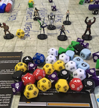

  

      <ul class="nav">
          <li><a href= "/pages/publica.html">artigos</a></li>
          <li><a href="https://sig.ufsb.edu.br/sigaa/public/docente/portal.jsf?siape=1085938">sigaa</a></li>
          <li><a href="https://www.researchgate.net/profile/Francisco-Nascimento">researchgate</a></li>
          <li><a href="https://twitter.com/itxesco">twitter</a></li>
      </ul>
  

<table class="wide">
<tr>
  <td class="left">
    
  </td>
  <td class="right">
    
  </td>
</tr>
<tr>
  <td class="left">
    
  </td>
  <td class="right">
    
  </td>
</tr>
</table>

  

      <ul class="nav">
          <li><a href="pages/linksuteis.html">links úteis</a></li>
      </ul>
  

