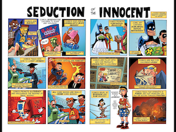
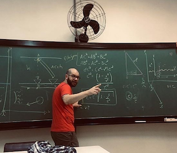

<html lang="pt-BR">
<head>
    <meta charset="UTF-8">
    <meta name="viewport" content="width=device-width, initial-scale=1.0">
    <title>Francisco Nascimento</title>
    <meta name="description" content="Francisco de Assis Nascimento Junior, professor Adjunto no Campus Sosígenes Costa da Universidade Federal do Sul da Bahia em Porto Seguro (BA), atuo na formação de professores; pesquisa as relações de identidade de gênero/étnico-raciais com a Ciência através de Histórias em Quadrinhos de Super-Heróis.">
    <meta name="keywords" content="Francisco de Assis Nascimento Junior, Ensino de Física, Ensino de Ciências, histórias em quadrinhos e Educação, Histórias em Quadrinhos e Ensino de Física, super-heróis, relações étnico-raciais, comunidade de aprendizagem, jogos de RPG, RPG e educação, RPG e ensino de Física, RPG e ensino de Ciências">
    <link rel="stylesheet" href="styles.css">
    
</head>
<body>

    <!-- Main Content -->
    <table class="tabela-imagens">
        <tr>
            <td>
                
            </td>
            <td>
                
            </td>
            <td>
                
            </td>
        </tr>
        <tr>
            <td>
                
            </td>
            <td>
                
            </td>
            <td>
                
            </td>
        </tr>
    </table>

</body>
</html>
