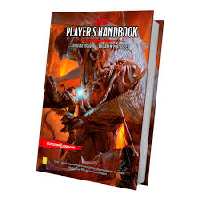

## 🧠 O que é o hiperfoco em autistas?

O **hiperfoco** é um aspecto comum em pessoas autistas e pode ser definido como um **estado intenso de concentração** e envolvimento em um interesse específico. É o que faz a pessoa autista se dedicar por horas a um único tema, atividade ou hobby, muitas vezes sem perceber a passagem do tempo e ignorando distrações externas.

---

### 📌 Tópicos desta página

1. [Características de um hiperfoco](#caracteristicas)  
2. [Ter um hiperfoco é algo bom ou ruim?](#bomouruim)  
3. [Conheça meus hiperfocos](#meus)  
4. [Hiperfoco ou Gosto Pessoal?](#gostos)

---

### 🔍 Características de um hiperfoco {#caracteristicas}

- **Atenção extrema:** Concentração profunda em um assunto ou atividade específica.  
- **Persistência:** Pode durar horas, dias ou até anos.  
- **Desconexão do ambiente:** Dificuldade em alternar para outras atividades.  
- **Sensação de prazer e domínio:** Proporciona satisfação e aprofundamento.  
- **Dificuldade em interromper:** Parar a atividade pode ser desafiador.

O hiperfoco pode ser uma ferramenta poderosa de aprendizado e realização, especialmente se for bem gerenciado.  
Exemplo: Eu tenho um hiperfoco em educação e me tornei professor. O campeão mundial de motociclismo Jorge Martin, autista, tem hiperfoco em... motociclismo.

---

### ↺ Ter um hiperfoco é algo bom ou ruim? {#bomouruim}

| 🟢 **Benefícios**                   | 🔴 **Desafios**                                 |
|------------------------------------|------------------------------------------------|
| Desenvolvimento de habilidades 💡  | Dificuldade em alternar tarefas 🗕️             |
| Aprendizado aprofundado 📚         | Exaustão mental ou física 😓                   |
| Produtividade elevada 🚀           | Pode gerar isolamento social 🤝❌              |
| Criatividade intensa 🎨            | Desregulação de sono e alimentação 🛌🍽️       |

Com estratégias adequadas, é possível equilibrar o hiperfoco para aproveitar seus benefícios sem comprometer o bem-estar.

---

### 🎯 Meus hiperfocos {#meus}

Meus hiperfocos se manifestam em diferentes áreas. Clique nos links para saber mais sobre cada um:

|  |  |  |
|:--:|:--:|:--:|
| [HQs de Super-Heróis](/pages/hiperfocos/quadrinhos/index_sh.html) | [Educação](/pages/hiperfocos/educacao/index_educacao.html) | [Mitologia Grega](/pages/hiperfocos/grecia/index_grecia.html) |

|  |  |  |
|:--:|:--:|:--:|
| [Jogos de RPG](/pages/hiperfocos/rpg/index_rpg.html) | [Moby Dick](/pages/hiperfocos/moby_dick/index_moby.html) | [The Rocky Horror Picture Show](/pages/hiperfocos/rockyhorror/index_rockyhorror.html) |

Esses hiperfocos me ajudam a produzir, criar, planejar, estudar, ensinar e me realizar como pessoa autista. Mas atenção: **hiperfoco não é a mesma coisa que gosto pessoal**.

---

### 🔎 Hiperfoco ou Gosto Pessoal? {#gostos}

O **gosto pessoal** envolve preferências como filmes, músicas ou hobbies. Pode ser intenso, mas:

- **É flexível** – Vários interesses coexistem.  
- **Não domina a rotina** – É fácil de pausar.  
- **Tem duração variada** – Pode ser passageiro.  
- **Não causa desconexão** – Não impede outras tarefas.

#### 🎭 Meus gostos pessoais:

- 🔭 Astronomia  
- ⚛️ Física  
- 🎲 Jogos de Tabuleiro  
- 🍹 Andar de Skate  
- 📺 Desenhos Animados  
- 📖 Literatura  
- 🚀 Ficção Científica  
- 🌍 Afrofuturismo  
- 🎮 Videogames

São todos incríveis, mas não são hiperfocos.

---

📌 [🔼 Voltar ao topo](#top)
